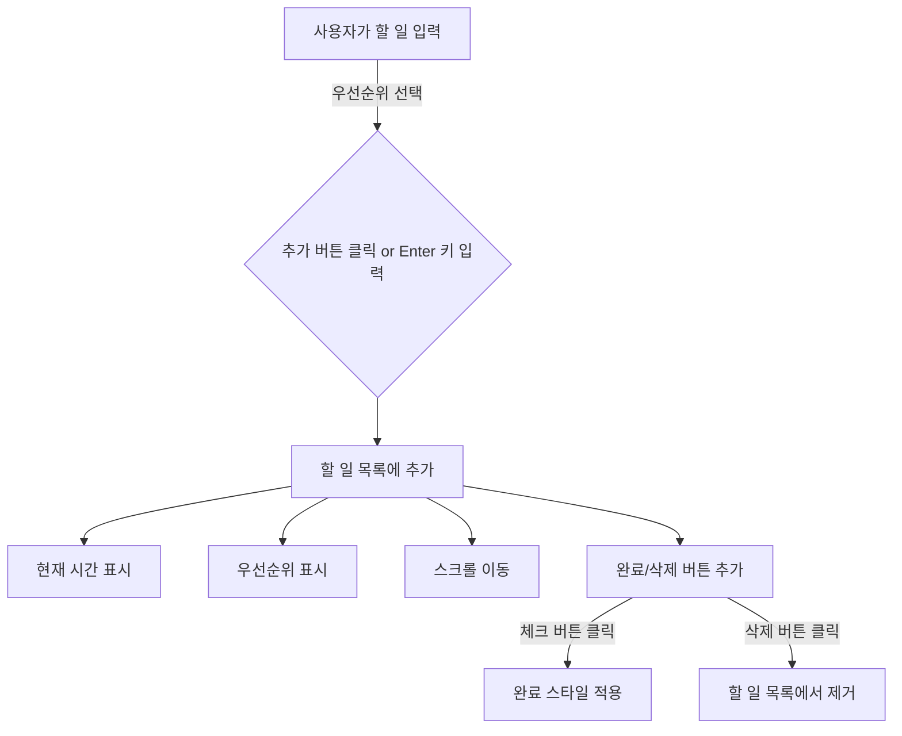

# 📝 To-Do List

## 📌 프로젝트 개요

HTML, CSS, JavaScript를 사용하여 간단한 **투두리스트(To-Do List)** 를 구현한 프로젝트입니다.

---

## 🚀 주요 기능

### ✅ 기본 기능

- 사용자가 **할 일을 추가**할 수 있음
- **체크 버튼**을 눌러 완료한 항목을 표시
- **삭제 버튼**을 눌러 항목을 제거

### 🕒 추가 기능

- **작성 시간 표시** → 할 일을 추가하면 `HH:MM` 형식으로 작성 시간이 함께 표시됨
- **우선순위 설정** → `🔥 높음`, `⚡ 보통`, `🌱 낮음` 중 선택 가능하며, 선택된 우선순위가 리스트에 함께 나타남

---

## 📌 플로우차트



---

## 📂 파일 구조

```
📦 프로젝트 폴더
 ┣ 📜 index.html  → 메인 페이지
 ┣ 📜 style.css   → 스타일 파일
 ┣ 📜 main.js     → 기능 구현 파일
 ┗ 📜 README.md   → 프로젝트 설명 문서
```

---

## 🛠️ 사용 기술

- **Frontend**: HTML, CSS, JavaScript
- **라이브러리**: FontAwesome (아이콘 사용)

---

## 📌 실행 방법

1. 프로젝트를 클론하거나 다운로드합니다.
2. `index.html` 파일을 실행하면 투두리스트가 작동합니다.

---

## 📌 업데이트 예정 기능

- [ ] **로컬 스토리지**를 활용한 데이터 저장
- [ ] **드래그 앤 드롭**을 통한 할 일 순서 변경
